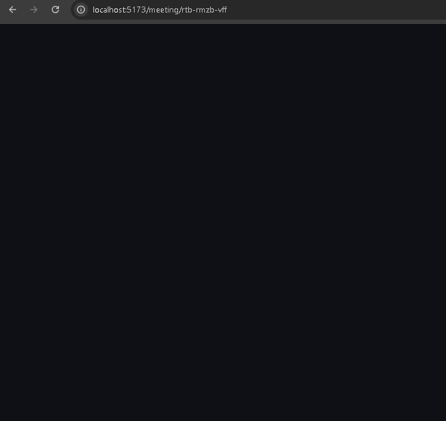
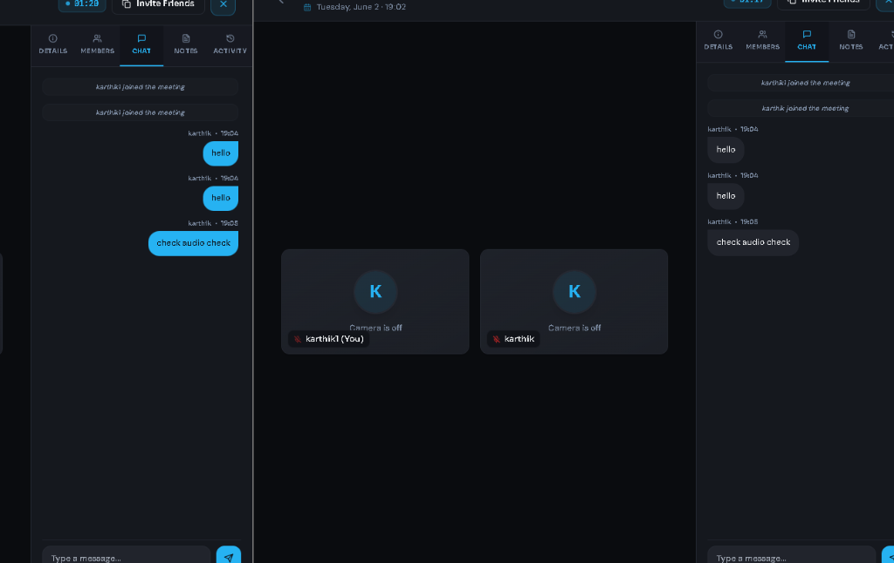

# MeetFlow 🚀

MeetFlow is a premium, real-time collaborative workspace and video conferencing application designed to streamline team communication, sprint planning, and post-meeting documentation. 

By combining modern WebRTC video rooms, instant direct/workspace chats, collaborative real-time notes canvas, and interactive Kanban boards synced with Groq AI, MeetFlow provides teams with a unified productivity environment.

---

## 📸 Screenshots

### Lobby Device Check-in


### Video Call Meeting Room


---

## 🛠️ Tech Stack

MeetFlow is built using a modern, robust, and responsive stack:

*   **Frontend**: React (Vite), Tailwind CSS, Lucide Icons, Socket.io-client, Date-fns, WebRTC APIs, Web Speech Recognition.
*   **Backend**: Node.js, Express, Socket.io, JWT Authentication, Bcryptjs.
*   **Database**: MongoDB (Mongoose ODM).
*   **AI Integration**: Groq API (running `llama-3.3-70b-versatile` for real-time summaries and task extraction).

---

## 🌟 Core Features

### 1. User Authentication & Security
*   **JWT Security**: Secured stateless sessions with HttpOnly cookie tokens.
*   **Role-Based Access**: Restricts channel CRUD operations and Kanban card deletions to workspace administrators/creators.
*   **Password Hashing**: Implements secure hashing using `bcryptjs`.

### 2. Real-Time Video Meetings
*   **WebRTC Video Calling**: High-quality peer-to-peer audio/video streaming.
*   **Smart Device Lobby**: Pre-check camera, select audio/video input devices, and check microphone levels in real time before joining.
*   **Continuity Fixes**: Stream audio/video continuously without track dropping or lobby mic locks.
*   **Screen Sharing**: Seamless switching between camera feeds and screen capture.

### 3. Real-Time Chats & Channels
*   **Workspace Channels**: Dedicated discussion channels (like `#general`, `#announcements`) with member permissions.
*   **Direct Messages**: Quick 1-on-1 direct messaging feeds.
*   **Typing Indicators & Emojis**: Live indicators showing active typers and native emoji select drawers.
*   **Mention Alerts**: Highlights and triggers notification counts for `@teammate` mentions.

### 4. Groq AI Integration
*   **Direct Message Summary**: Click the **Sparkles** icon inside any direct chat to get an on-demand summary card of recent conversations.
*   **Channel Summary**: Get concise summaries of public workspace discussion logs with one click.
*   **AI Transcription**: Live speech segment transcription recorded directly into the session timeline.
*   **Action Item Parsing**: Automatically parses meeting notes and chats post-meeting to extract action items with priority levels and target assignees.

### 5. Team & Kanban Project Boards
*   **Kanban Sprints**: Drag and update tasks through `Todo`, `In Progress`, and `Done` states.
*   **Target Workspace Sync**: Choose which workspace Kanban board to assign meeting action items to using a confirmation modal popup.
*   **Admin-Only Deletions**: Deleting task cards is restricted to workspace administrators, synchronized instantly across all screens.

### 6. Interactive Analytics Dashboards
*   **Meeting Frequency Metrics**: Renders call duration summaries and weekly counts.
*   **Milestone Velocity**: Custom interactive SVG charts showing sprint task completion progress.
*   **Engagement Reports**: Lists chat counts and meetings attended per teammate.
*   **Export Options**: Export raw analytics tables to CSV or print meeting reports to clean PDF documents.

---

## 🚀 Installation & Local Setup

### Prerequisites
*   Node.js (v18 or higher recommended)
*   MongoDB Instance (Local database or MongoDB Atlas cloud cluster)
*   Groq API Key (Obtained from [Groq Console](https://console.groq.com/))

### Step 1: Clone the Repository
```bash
git clone https://github.com/karthik-kotra/meetflow.git
cd meetflow
```

### Step 2: Configure Environment Variables
Create a `.env` file inside the `backend` folder:
```bash
cp backend/.env.example backend/.env
```
Open `backend/.env` and configure your credentials:
```env
PORT=5000
MONGO_URI=your_mongodb_connection_string
JWT_SECRET=your_jwt_secret_key
GROQ_API_KEY=your_groq_api_key
```

### Step 3: Install Dependencies
Install packages for both frontend and backend directories:
```bash
# Root (Frontend)
npm install

# Backend
cd backend
npm install
```

### Step 4: Run the Application
Start the development servers concurrently:

**Start Frontend (Vite):**
```bash
# From workspace root
npm run dev
```

**Start Backend (Express):**
```bash
# From backend directory
npm run dev
```

The app will be active locally at `http://localhost:5173`.

---

## 📦 Production Deployment

To package MeetFlow for production deployment:

1.  **Build Frontend Asset Bundle**:
    ```bash
    npm run build
    ```
2.  **Configure Environment Variables**: Set all production env variables (`PORT`, `MONGO_URI`, `JWT_SECRET`, `GROQ_API_KEY`) on your hosting platform (e.g., Render, Heroku, AWS).
3.  **Run Production Server**:
    ```bash
    cd backend
    npm start
    ```
