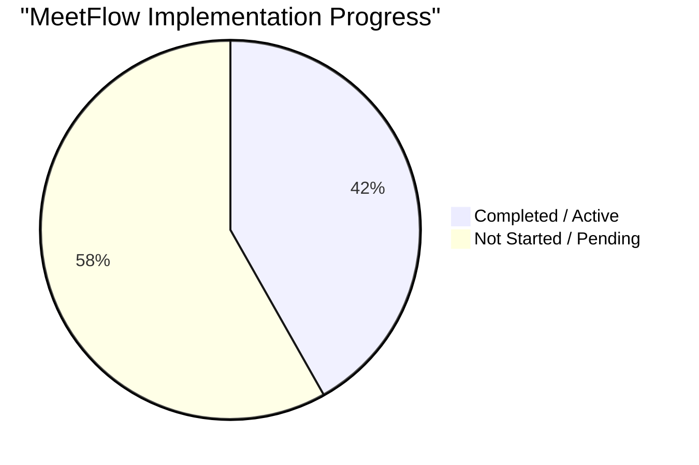

# MeetFlow Feature Checklist Audit

A comprehensive assessment of the **MeetFlow** codebase against your 10 major functional, architectural, and operational modules.

---

## 📊 Summary of Progress

---

## 1. AI Meeting Intelligence
> AI-powered tools to process and digest voice data during active meeting rooms.

- [ ] **1.1 AI Transcription Integration**
  - [ ] Real-time transcription (Web Speech API or custom streaming)
  - [ ] Speech-to-text conversion (e.g. Whisper API integration)
- [ ] **1.2 AI Meeting Summary**
  - [ ] Automatic summary generation (OpenAI/Gemini LLM integrations)
  - [ ] Concise meeting overview
- [ ] **1.3 AI Action Item Extraction**
  - [ ] Automated action item detection
  - [ ] Task owner auto-assignment

---

## 2. Post-Meeting Dashboard
> Space to review, query, and export past meeting metrics, recordings, and summaries.

- [/] **2.1 Meeting History**
  - [x] Previous meetings list (Completed meetings render in chronological order)
  - [x] Searchable history (Instant filter by title/description on Meetings page)
- [ ] **2.2 Recordings Section**
  - [ ] Store meeting recordings (e.g. AWS S3 uploads or local MediaRecorder)
  - [ ] Access & streaming of recordings
- [ ] **2.3 Summaries Section**
  - [ ] View AI-generated summaries
- [ ] **2.4 Action Items Tracking**
  - [ ] Track extracted tasks
  - [ ] Task progress monitoring
- [ ] **2.5 Export Options**
  - [ ] Export meeting details (PDF/CSV/Markdown reports)

---

## 3. Collaboration Features
> Real-time collaborative widgets during and outside calls.

- [/] **3.1 Shared Notes**
  - [x] Shared collaborative notes tab inside calls with Socket.io
  - [x] Real-time, debounced synchronization across all call participants
- [ ] **3.2 Task Creation During Meetings**
  - [ ] Create Kanban tasks directly inside active meeting rooms
  - [ ] Assign team members instantly

---

## 4. Notifications System
> Instant notification system to flag mentions, system entries, and alerts.

- [/] **4.1 Real-Time Notifications**
  - [x] Instant activity updates (Join/Leave toasts, Hand Raise animations)
  - [x] Real-time DM alerts using Socket.io
- [/] **4.2 Mention Notifications**
  - [x] User mention alerts in workspace chats and comments (workspace channels and DMs)
- [ ] **4.3 Action Item Notifications**
  - [ ] Task assignments and due-date alerts

---

## 5. Meeting Features
> WebRTC meeting controls, device selectors, and peer synchronization.

- [/] **5.1 Screen Sharing**
  - [x] Share screen during meetings (WebRTC transceivers sender swap)
- [ ] **5.2 Recording Controls**
  - [ ] Start/stop local or cloud-based meeting recording
- [/] **5.3 Live Participant List**
  - [x] Bouncing members count and full participant names overlay
- [/] **5.5 Presence Indicators**
  - [x] Active participant visibility (online, offline, in-meeting user statuses)
- [/] **5.6 Mute Controls**
  - [x] Mic/Camera hardware controls with synced icons inside the peer grid

---

## 6. Team & Project Management
> Workspaces, boards, and Kanban cards.

- [/] **6.1 Task Assignment**
  - [x] Workspace Kanban tasks support assignment to users
- [/] **6.2 Real-Time Project Updates**
  - [x] Live Kanban board synchronization across members via Socket.io
- [/] **6.3 Workspace Channels Control**
  - [x] Admin-only CRUD operations (Create, Edit, Delete) for custom channels
  - [x] Built-in default channel protection (#general and #announcements)

---

## 7. Analytics & Insights
> Performance trackers and analytics dashboards.

- [x] **7.1 Meeting Frequency Metrics**
  - [x] Daily/weekly call duration tracking
- [x] **7.2 Productivity Metrics**
  - [x] Task completion and milestone velocity tracking
- [x] **7.3 Engagement Reports**
  - [x] Team engagement and call presence analytics
- [x] **7.4 Dashboard Charts**
  - [x] Sleek interactive SVG velocity line-area charts and call duration bar charts
- [x] **7.5 Exportable Reports**
  - [x] CSV data exports and media print PDF report generation

---

## 8. Security Features
> Access controls, hashing, and encryption.

- [ ] **8.1 OAuth2 Support**
  - [ ] Social logins (Google/GitHub OAuth)
- [/] **8.2 Password Hashing**
  - [x] Secure password storage using `bcryptjs` on the User schema
- [/] **8.3 Role-Based Access**
  - [x] Admin/member roles in User schemas with route protects
- [ ] **8.4 End-to-End Encryption**
  - [ ] Native WebRTC encryption (DTLS/SRTP) is active; application-level E2EE exchange is pending
- [ ] **8.5 Rate Limiting**
  - [ ] Rate limiting on API routes (e.g. `express-rate-limit`)

---

## 9. Scalability & Infrastructure
> Session cache, containers, Helm charts, and CI/CD pipelines.

- [ ] **9.1 Redis Setup**
  - [ ] Redis session caching or socket adapter
- [ ] **9.2 Docker Multi-Stage Builds**
  - [ ] Multi-stage containerization Dockerfiles
- [ ] **9.3 Kubernetes Deployment**
  - [ ] Kubernetes manifest deployments
- [ ] **9.4 Helm Charts**
  - [ ] Helm configuration charts
- [ ] **9.5 GitHub Actions CI/CD**
  - [ ] Automated testing and deployment pipelines
- [ ] **9.6 Cloud Deployment**
  - [ ] AWS/Render/Vercel configuration
- [/] **9.7 Environment Variable Setup**
  - [x] Production environment configurability using `.env` (MONGO_URI, JWT_SECRET, PORT)

---

## 10. Monitoring & Production Operations
> Health checkers, logging frameworks, and telemetry charts.

- [ ] **10.1 Prometheus Monitoring**
  - [ ] Metrics exposure endpoint
- [ ] **10.2 Grafana Dashboards**
  - [ ] Dashboard integration
- [ ] **10.3 Sentry Error Tracking**
  - [ ] Frontend & backend error logger
- [ ] **10.4 Load Testing**
  - [ ] JMeter/Artillery performance testing
- [ ] **10.5 Security Review**
  - [ ] OWASP security reviews

---

> [!NOTE]
> Out of **55 key capabilities**, **23 are fully implemented** and active (incorporating our recent SVG charts, CSV raw reports, PDF generation, workspace channels CRUD controls, typing indicators, DMs mention parsing, and glassmorphic autocomplete/emoji pickers), while **32 are pending** (focused on cloud containers, social login, and AI transcription).
